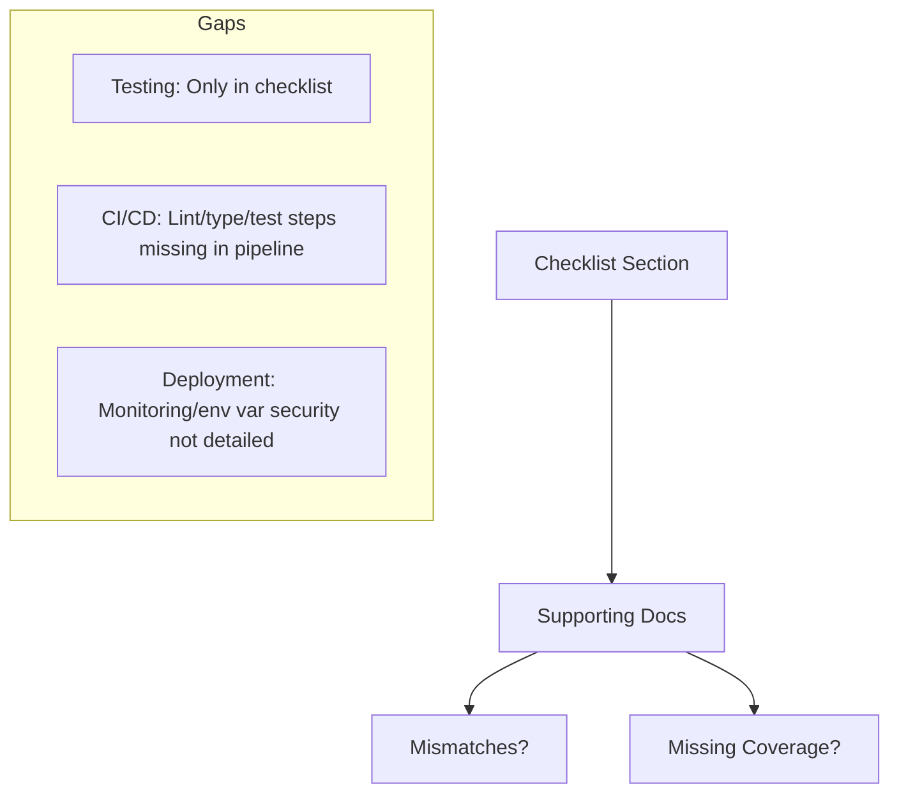

# Architecture Review: Checklist Coverage, Mismatches, and Documentation Gaps

## 1. Approach & Methodology

- Extracted all main sections from every markdown document in the repo.
- Read the full `architecture_decision_checklist.md`.
- Cross-referenced each checklist section with the relevant supporting documents.
- Checked for mismatches, contradictions, and missing coverage.
- Searched for explicit mentions of testing and mocks.

---

## 2. Coverage & Consistency Analysis

### A. Project Structure & Code Organization
- **Checklist Requirements:** Monorepo, clear separation of pages, components, services, types, and DB/API layer.
- **Supporting Docs:** 
  - `nextjs_monorepo_ssr_loose_coupling_plan.md` (Recommended Project Structure, Key Practices)
  - `comparison_nextjs_monorepo_vs_split.md` (Structure sections)
- **Result:** 
  - Structure and decoupling are consistently described and match the checklist.
  - No mismatches found.

---

### B. SSR & Data Fetching
- **Checklist Requirements:** Use SSR for dynamic data, fetch via service functions, avoid unnecessary API endpoints.
- **Supporting Docs:** 
  - `nextjs_ssr_vs_api.md` (SSR vs API, when to use each)
  - `nextjs_monorepo_ssr_loose_coupling_plan.md` (Thin controllers, SSR examples)
- **Result:** 
  - All documents recommend SSR for dynamic data and direct service function calls.
  - No contradictions or mismatches.

---

### C. Authentication & Authorization (SSR)
- **Checklist Requirements:** HTTP-only cookies, session validation, user-specific data, service-layer authorization, redirect unauthenticated users, scalable infra.
- **Supporting Docs:** 
  - `nextjs_ssr_auth_sessions.md` (Session handling, security, best practices)
- **Result:** 
  - All checklist points are covered in detail.
  - No mismatches.

---

### D. Testing
- **Checklist Requirements:** Unit tests for services, integration tests for API/SSR, type-safe mocks, 100% type coverage.
- **Supporting Docs:** 
  - No supporting document covers testing strategy, mocks, or type coverage.
- **Result:** 
  - **Gap:** Testing requirements are only in the checklist, not in supporting docs. No justification or implementation details elsewhere.

---

### E. CI/CD
- **Checklist Requirements:** Single pipeline, install deps, lint/type check, run all tests, build, deploy, use env vars, fail on errors.
- **Supporting Docs:** 
  - `comparison_nextjs_monorepo_vs_split.md` (Sample CI/CD pipelines)
- **Result:** 
  - Pipelines cover install, build, deploy, and use secrets for GCP.
  - **Gap:** Pipelines do not mention linting, type checks, or running tests. No explicit fail-on-error steps for these.
  - **Partial mismatch** with checklist.

---

### F. Deployment
- **Checklist Requirements:** Deploy as container, single artifact, secure env vars, monitor health.
- **Supporting Docs:** 
  - `comparison_nextjs_monorepo_vs_split.md` (Deployment steps)
- **Result:** 
  - Deployment to Cloud Run as container is covered.
  - Secure env vars and monitoring are mentioned in checklist but not detailed in supporting docs.
  - **Minor gap**: Monitoring/alerts not covered in supporting docs.

---

### G. Future-Proofing
- **Checklist Requirements:** Decouple business logic/types from Next.js, document deviations.
- **Supporting Docs:** 
  - `nextjs_backend_separation_possibilities.md` (Best practices, migration path)
- **Result:** 
  - Decoupling and migration are well covered.
  - No mismatches.

---

## 3. Mismatches & Gaps Summary

| Checklist Section         | Mismatches/Contradictions | Missing Coverage in Docs? |
|--------------------------|---------------------------|---------------------------|
| Project Structure        | None                      | No                        |
| Code Organization        | None                      | No                        |
| SSR & Data Fetching      | None                      | No                        |
| Auth & Authorization     | None                      | No                        |
| Testing                  | N/A                       | **Yes**                   |
| CI/CD                    | **Partial**               | **Yes**                   |
| Deployment               | **Minor**                 | **Yes**                   |
| Future-Proofing          | None                      | No                        |

---

## 4. Visual Summary (Mermaid Diagram)

---

## 5. Recommendations

- **Testing:** Add a section in the documentation (or a new doc) detailing the testing strategy, required coverage, and use of mocks/stubs.
- **CI/CD:** Update the sample pipeline to include linting, type checks, running tests, and explicit fail-on-error steps.
- **Deployment:** Add documentation on secure environment variable management and deployment monitoring/alerting.
- **Checklist Deviations:** If any of these gaps are intentional, document and justify them as required by the checklist.

---

## 6. Conclusion

The architecture documentation is generally consistent and well-aligned with the checklist, except for the noted gaps in testing, CI/CD, and deployment monitoring. Addressing these will ensure full coverage and compliance with the architectural standards.