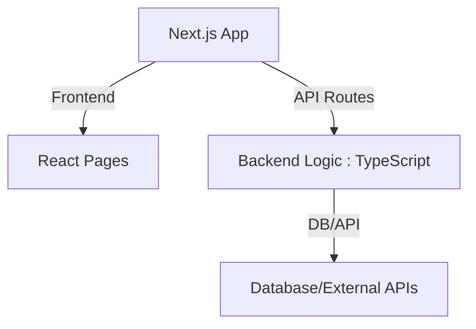
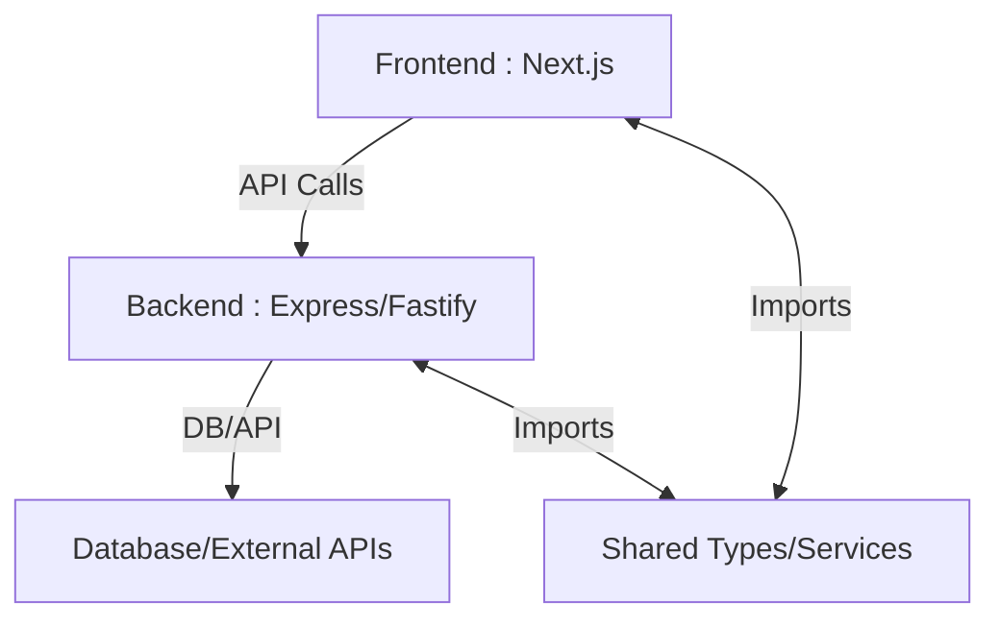

# Migrating from Fullstack Next.js Monorepo to Separate Backend

## How Next.js API Routes Work

- Next.js API routes are serverless functions (or server handlers) under `/pages/api`.
- They are great for simple APIs, authentication, and proxying.
- They are limited for long-running jobs, WebSockets, or advanced backend features.

---

## Possibility of Separating the Backend Later

### What Makes Separation Easier

- **Business logic is decoupled from API route handlers.**
- Shared types and utilities are in a separate folder/package (e.g., `/lib` or `/shared`).
- Minimal direct coupling between frontend and backend code.
- API routes act as thin controllers, delegating to service modules.

### What Makes Separation Harder

- Business logic is tightly coupled to API route files.
- Direct imports from frontend to backend or vice versa.
- No clear separation of concerns.

---

## Best Practices to Future-Proof for Separation

1. **Service Layer:**  
   Place core business logic in `/lib/services` or `/shared/services`, not directly in API route files.

2. **Shared Types:**  
   Define TypeScript types/interfaces in a shared folder (`/lib/types` or `/shared/types`).

3. **API Contracts:**  
   Use clear request/response shapes, and consider using tools like tRPC or OpenAPI for contract definition.

4. **Environment Variables:**  
   Use environment variables for backend config, not hardcoded values.

5. **Minimal API Handler Logic:**  
   Keep `/pages/api/*.ts` files as thin as possible—just parse input, call service, return result.

---

## Migration Path: Next.js API Routes → Standalone Backend

### Step 1: Prepare Codebase

- Move business logic and types to `/lib` or `/shared`.
- Refactor API routes to use these shared modules.

### Step 2: Create Standalone Backend

- Scaffold a new Express/Fastify app (in `/backend`).
- Copy service modules and types from `/lib` or `/shared`.
- Re-implement API endpoints in Express/Fastify, using the same service modules.

### Step 3: Update Frontend

- Change API calls in the frontend to point to the new backend URL (instead of `/api/...`).

### Step 4: Remove or Deprecate Next.js API Routes

- Optionally, keep `/api` routes as proxies to the new backend during transition.

---

## Mermaid Diagram: Before and After

### Before: Fullstack Next.js

### After: Split Frontend/Backend

---

## Summary

- **Separation is straightforward if you keep business logic and types decoupled from API route files.**
- Plan for separation by using a service layer and shared types from the start.
- Migration involves moving service code to a new backend, updating API endpoints, and switching frontend calls.

**This approach lets you start fast with Next.js, and scale to a more robust backend when needed, with minimal pain.**
