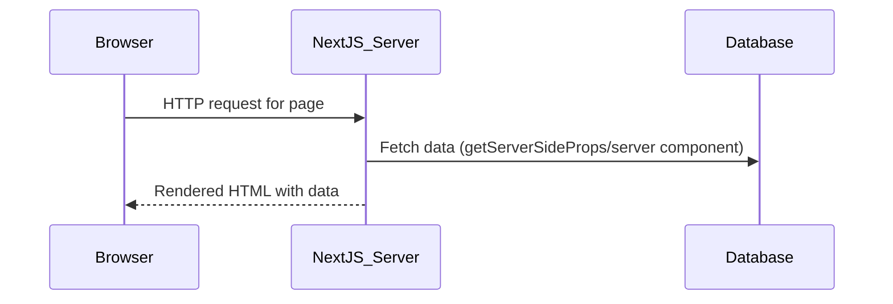
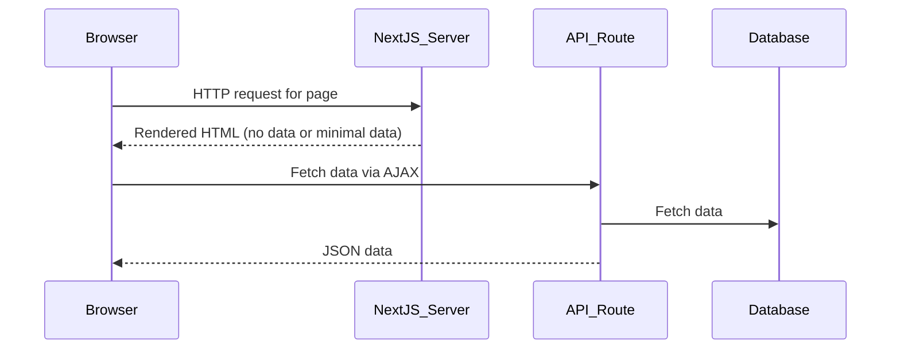

# Next.js Server-Side Rendering (SSR) vs. API Endpoints

## How SSR Can Remove the Need for APIs

- In Next.js, you can fetch data directly on the server using:
  - `getServerSideProps` (pages directory)
  - `getStaticProps` (for static generation)
  - **Server Components** (in the new app directory)
- These methods allow you to access databases, files, or external APIs directly from your page or component code, without creating a separate API route.

---

## When SSR Data Fetching is Suitable

- **Internal data only needed for rendering pages**
- No need for client-side JavaScript to fetch data after page load
- No third-party consumers (e.g., mobile apps) needing your API
- SEO is important (SSR provides pre-rendered HTML)

---

## When You Still Need API Endpoints

- Data must be fetched from the browser (client-side) after initial page load (e.g., for dynamic UIs, forms, SPA features)
- You want to expose your backend to other clients (mobile apps, other services)
- You need to decouple frontend and backend for scaling or security
- You want to reuse backend logic outside of Next.js

---

## Pros and Cons

| Approach         | Pros                                              | Cons                                              |
|------------------|--------------------------------------------------|---------------------------------------------------|
| SSR Data Fetch   | - No need for extra API code - Simpler for small apps - Fast initial load, SEO | - Harder to reuse logic for other clients - Less flexible for dynamic UIs - Tightly coupled to Next.js |
| API Endpoints    | - Decoupled frontend/backend - Reusable for other clients - Good for dynamic UIs | - More boilerplate - Slightly more complex setup |

---

## Data Flow Diagrams

### SSR Data Fetching (No API)

### API Endpoint Approach

---

## Summary

- **SSR/server components** are great for simple apps where all data can be fetched at render time and no other clients need your backend.
- **API endpoints** are needed for more dynamic apps, client-side interactivity, or when you want to expose your backend to other consumers.

**You can mix both approaches in a Next.js app, using SSR for some pages and APIs for others as needed.**